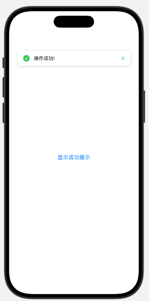
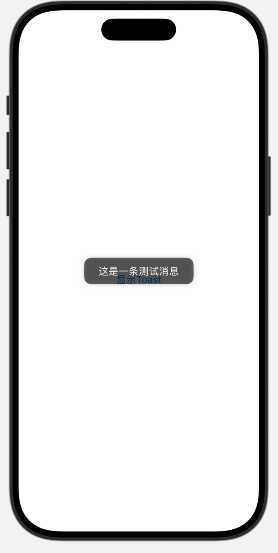
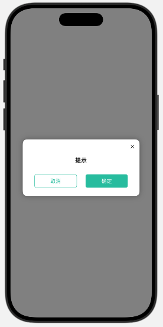

# ToastUI

一个简单易用的SwiftUI消息提示组件。




## 功能特点

- 支持成功、错误、警告、信息四种提示样式
- 可自定义显示时间
- 支持关闭按钮
- 简单易用的API

## 安装方法

### Swift Package Manager

在Xcode中：
1. File > Swift Packages > Add Package Dependency
2. 输入仓库URL: https://github.com/TPSHION/ToastUI.git
3. 选择版本规则（建议使用最新版本）

### 手动集成

将Sources/ToastUI目录下的文件直接拷贝到你的项目中。

## 使用方法
### 1、消息提示

```swift
import SwiftUI
import ToastUI

struct ContentView: View {
    @State private var showMessage: Message? = nil
    
    var body: some View {
        VStack {
            Button("显示成功提示") {
                showMessage = Message(style: .success, message: "操作成功!")
            }
        }
        .message(message: $showMessage)
    }
}

#Preview {
    ContentView()
}
```

### 2、toast轻提示
```swift
import SwiftUI
import ToastUI

struct ContentView: View {
    var body: some View {
        VStack {
            Button("显示Toast") {
                Toast("这是一条测试消息")
            }
        }
        .padding()
    }
}

#Preview {
    ContentView()
}
```


### 3、弹窗提示
```swift
import SwiftUI
import ToastUI

struct ContentView: View {
    
    @State private var showPop: Bool = false
    @State private var popTitle: String = ""
    
    var body: some View {
        VStack {
            Button("测试弹窗") {
                showPop = true
                popTitle = "提示"
            }
        }
        .padding()
        .popup(
            isPresented: $showPop,
            title: popTitle,
        )
    }
}

#Preview {
    ContentView()
}
```
